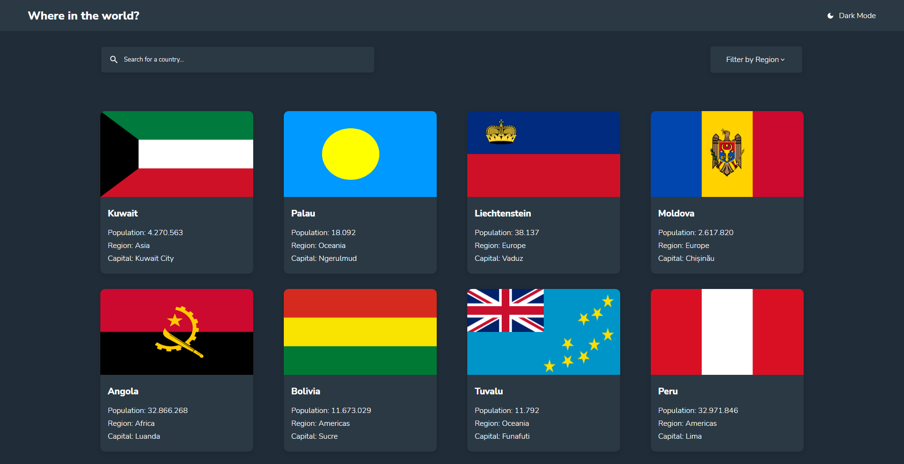

# Where in the world?

## The challenge

Users should be able to:

- See all countries from the API on the homepage
- Search for a country using an input field
- Filter countries by region
- Click on a country to see more detailed information on a separate page
- Click through to the border countries on the detail page
- Toggle the color scheme between light and dark mode (optional)

## Screenshot of the final solution

## Links

You can find my solution online at 

- Vercel [https://frontend-countries-five.vercel.app/]

## Tools

- React and CSS3

## Author

- Enzo Bocalon [https://github.com/enzobocalon]
